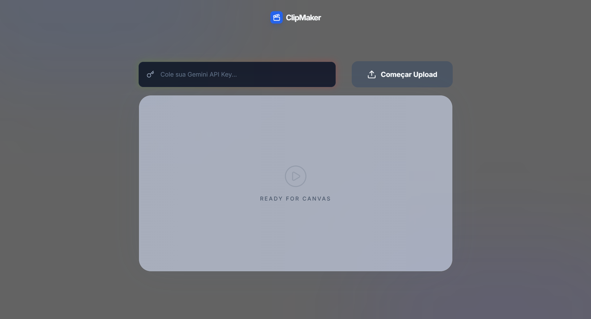

<p align="center"></p>

# 🎬ClipMaker — AI Viral Moments

Aplicação web que usa **IA (Gemini)** para analisar vídeos enviados pelo usuário e identificar automaticamente o trecho mais viral, engraçado ou surpreendente, gerando um clipe pronto para compartilhar.



 


---

## Como funciona

1. O usuário insere sua **Gemini API Key**
2. Faz o upload do vídeo via **Cloudinary**
3. O Cloudinary transcreve o áudio automaticamente
4. A transcrição é enviada ao **Gemini**, que identifica o melhor trecho
5. O clipe é gerado dinamicamente via URL do Cloudinary e exibido no player

---

## 🛠️ Tecnologias e Ferramentas Utilizadas

- **Frontend:** HTML5, CSS3, JavaScript (Vanilla)
- **Estilização:** Tailwind CSS (via CDN)
- **Animações:** GSAP (GreenSock)
- **Ícones:** Lucide Icons
- **Vídeo & Storage:** Cloudinary (Upload Widget & Transformaçōes de Mídia)
- **Inteligência Artificial:** Google Gemini API (`gemini-2.5-flash`)

---

## ⚙️ Como rodar o projeto localmente

Como este é um projeto focado no Front-end (Vanilla JS), não é necessário o uso de Node.js ou bundlers para rodá-lo, apenas um servidor local.

### Pré-requisitos
- Uma conta no [Cloudinary](https://cloudinary.com/) (com um *Upload Preset* configurado como "Unsigned" e o add-on de transcrição ativado).
- Uma chave de API do [Google AI Studio (Gemini)](https://aistudio.google.com/).
- Extensão *Live Server* do VS Code (ou similar).

#### Passo a Passo

#### 1. **Clone o repositório:**

   ```bash
   git clone https://github.com/Jotshh/ClipMaker-NLW.git
   cd ClipMaker-NLW 
   ```

#### 2. Configure o Cloudinary

No painel do Cloudinary, certifique-se de que o **Upload Preset** está com:
- Modo: `Unsigned`
- **Auto transcription** habilitada nas transformações de vídeo

#### 3. Configure as variáveis de ambiente

Copie o arquivo de exemplo e preencha com suas credenciais:

```bash
cd .config.example.js
```

| Variável | Descrição |
|---|---|
| `CLOUDINARY_NAME: 'seu_cloud_name_aqui',` | Nome do seu cloud no Cloudinary |
| `UPLOAD_PRESET: "seu-upload-preset"` | Upload preset configurado no Cloudinary (modo `unsigned`) |

#### 4. **Inicie o projeto:**

- Abra o arquivo index.html com o Live Server (ou seu servidor local de preferência).

- Na interface web, cole sua Gemini API Key no campo designado.

- Clique em "Começar Upload" e teste a mágica!

---

## 📁 Estrutura do projeto

```
ClipMaker-NLW/
├── index.html                  # Página principal
├── assets/                     # Arquivos estáticos da aplicação
├── css/
│   └── styles.css              # Estilos customizados
├── js/ 
│   └── app.js                  # Lógica da aplicação
│   └── config.example.js       # Modelo de variáveis de ambiente        
├── .gitignore
└── README.md
```

---

## Licença

MIT

---

Desenvolvido por Josiel durante o NLW da Rocketseat 2026
